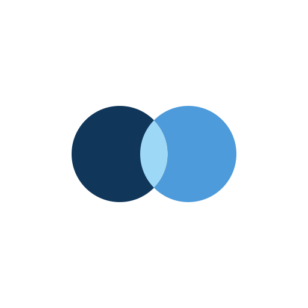
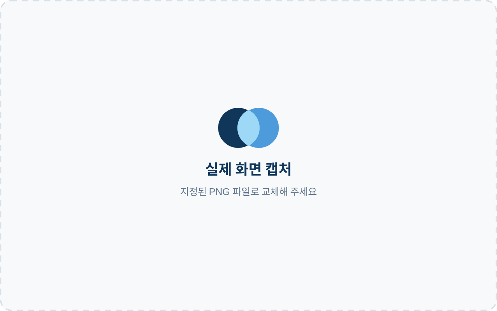

<p align="center">
  
</p>

<h1 align="center">단디계약</h1>

<p align="center">부산 관광상권 소상공인의 계약 이해와 조정을 돕는 AI 계약 관리 서비스</p>

<p align="center"><strong>읽지 못한 계약을 함께 읽고, 하지 못했던 말을 꺼낼 수 있게.</strong></p>

<p align="center">
  <a href="https://ai-builder-sprint-a-idios-mu.vercel.app/">운영 웹 앱 열기</a> ·
  <a href="https://ai-builder-sprint-aidios.onrender.com/api/v1/health">API 상태 확인</a>
</p>

## 왜 단디계약인가

작은 사업자는 계약의 당사자이지만, 어려운 문구와 정보의 격차 앞에서 자신의 사정을
충분히 설명하거나 정당한 조건을 요청하기 어렵습니다. 단디계약은 계약서를 분석하는
AI에서 한 단계 더 나아가, **작은 사업자가 자신의 목소리를 잃지 않고 상대방과 공정하게
대화하도록 돕는 계약 동반자**입니다.

- 어려운 조항은 원문 근거와 함께 풀어 사용자가 스스로 판단할 수 있게 합니다.
- 위험만 지적하지 않고 관계를 고려한 조정안과 문의 문장을 함께 제안합니다.
- 발송·수락·서명처럼 책임이 따르는 결정은 자동화하지 않고 사용자에게 맡깁니다.

AI는 계약 당사자를 대신하지 않습니다. 정보와 협상력의 차이를 줄여 사용자가 계약을
이해하고, 필요한 말을 건네고, 마지막 결정을 직접 내릴 수 있도록 돕습니다.

## MVP 흐름

`계약서 업로드 → 조건 추출 → 불일치·누락 검토 → 조정 요청 → 상대방 응답 → 수정 계약서 업로드·대조 → 모두싸인 → 산출물 증빙 → 광고효과 기록·대조 → 만료·재계약 확인`

광고효과 기록·대조(기획안 6.14)는 P2입니다. 백엔드 16.2 리포트 업로드, 16.3
Upstage·Solar 지표 추출, 16.4 사용자 확정·정정, 16.5 계약 대조·조회까지 구현했습니다.
프런트엔드도 월별 업로드, 원문 근거 확인, 확정·append-only 정정, 월별 집계와 문의 문안
조회까지 같은 API에 연결했습니다.
로컬 FastAPI 실제 TCP·live Supabase Auth/Storage/PostgreSQL·Upstage Parse·
Solar를 함께 거친 16.2~16.5 수직 E2E도 통과했습니다. 배포 환경 검증은 별도입니다.

## 핵심 기능

| 단계 | 제공 기능 |
| --- | --- |
| 계약 등록·분석 | 계약서와 보조 자료를 업로드하고 기간·금액·해지·환불·산출물 조건을 구조화합니다. |
| 근거 기반 검토 | 추출·검토 결과에 원문 페이지, 문장, 확신도를 연결하고 사용자가 직접 확인합니다. |
| 조정 요청 | 관계와 상황을 고려한 원안 수용·절충안·요청안 중 사용자가 문구를 고르고, 공개 링크로 대행사의 수락·거절·역제안을 받습니다. |
| 수정 계약서·서명 | 합의 내용이 수정 계약서에 반영됐는지 다시 대조하고 모두싸인 상태를 추적합니다. |
| 이행·광고효과 | 산출물 증빙과 월간 광고 리포트를 계약 조건·전월 기록에 대조해 확인 신호와 문의 문안을 만듭니다. |
| 만료·재계약 | 만료·해지 통보·자동 갱신 시점을 계산하고 사용자의 재계약 의사를 기록합니다. |

발송, 역제안 수락, 서명 시작, 증빙 승인, 계약 갱신은 자동으로 실행하지 않으며 사용자가
항상 최종 확인합니다.

## 서비스 화면

아래 자리는 실제 운영 화면 캡처로 교체할 예정입니다. 캡처 파일 규격과 안전 확인 사항은
[docs/screenshots/README.md](docs/screenshots/README.md)를 참고하세요.

<table>
  <tr>
    <td width="50%" align="center">
      <strong>계약 원문·근거 검토</strong><br /><br />
      <br />
      <code>docs/screenshots/01-contract-review.png</code>
    </td>
    <td width="50%" align="center">
      <strong>조정 요청·대행사 응답</strong><br /><br />
      <br />
      <code>docs/screenshots/02-adjustment-response.png</code>
    </td>
  </tr>
  <tr>
    <td width="50%" align="center">
      <strong>이행·광고효과 관리</strong><br /><br />
      <br />
      <code>docs/screenshots/03-performance-management.png</code>
    </td>
    <td width="50%" align="center">
      <strong>만료·재계약 검토</strong><br /><br />
      <br />
      <code>docs/screenshots/04-renewal-review.png</code>
    </td>
  </tr>
</table>

## 저장소 구조

```text
.
├── apps/
│   ├── frontend/            # 소상공인·대행사 반응형 웹
│   └── api/                 # 계약·AI·전자서명 FastAPI
├── packages/
│   └── contracts/           # 프런트/백엔드가 공유할 API·JSON 스키마
├── supabase/
│   └── migrations/          # PostgreSQL 스키마 변경 이력
├── fixtures/
│   ├── demo/                # 발표용 가상 데이터
│   └── evaluation/          # AI 고정 평가 데이터 10건
└── docs/                    # 제품 범위·아키텍처·대회 안내
```

세부 경계와 파일 배치 원칙은 [docs/architecture.md](docs/architecture.md), 공통 HTTP·데이터
규칙은 [docs/api-data-contract.md](docs/api-data-contract.md)를 참고하세요.

## 기술 스택

| 영역 | 기술 |
| --- | --- |
| 웹 | Next.js 16, React 19, TypeScript, Tailwind CSS 4 |
| API | Python 3.12, FastAPI, Pydantic, Uvicorn |
| AI 문서 처리 | Upstage Document Parse·Universal Extraction, Solar |
| 데이터·인증 | Supabase PostgreSQL, Auth, private Storage |
| 전자서명 | 모두싸인(Modusign) Adapter |
| 배포 | Vercel, Render, Supabase, GitHub |
| 품질 확인 | Node test runner, ESLint, pytest, Ruff, 고정 AI 평가 fixture |

## 로컬 실행

요구 사항:

- Node.js 22.13 이상
- Python 3.12 이상

웹:

```bash
cd apps/frontend
cp .env.example .env.local
npm install
npm run dev
```

API:

```bash
cd apps/api
cp .env.example .env
python -m venv .venv
source .venv/bin/activate
pip install -e ".[dev]"
uvicorn app.main:app --reload
```

기본 주소:

- 웹: `http://localhost:3000`
- API 문서: `http://localhost:8000/docs`
- 상태 확인: `http://localhost:8000/api/v1/health`

## 배포 환경

운영 배포는 프런트엔드와 API를 분리합니다.

| 영역 | 플랫폼 | 운영 주소 | 설정 |
| --- | --- | --- | --- |
| 웹 프런트엔드 | Vercel | [웹 앱 열기](https://ai-builder-sprint-a-idios-mu.vercel.app/) | `apps/frontend`, Next.js |
| API 서버 | Render | [API 기본 주소](https://ai-builder-sprint-aidios.onrender.com) · [상태 확인](https://ai-builder-sprint-aidios.onrender.com/api/v1/health) | `apps/api`, FastAPI/Uvicorn, Singapore 리전 |
| 데이터베이스·인증·파일 | Supabase | 비공개 프로젝트 | PostgreSQL, Auth, Storage |
| 소스·배포 트리거 | GitHub | 저장소 배포 연동 | `main`을 운영 기준 브랜치로 사용 |

Render의 시작 명령은 다음과 같습니다.

```text
uvicorn app.main:app --host 0.0.0.0 --port $PORT
```

Vercel의 Root Directory는 `apps/frontend`, Render의 Root Directory는 `apps/api`입니다.
각 서비스에서 `main` 브랜치의 커밋을 자동 배포하도록 설정합니다.

운영 환경에서 Render에는 `APP_ENV=production`, `SUPABASE_MODE=live`,
`UPSTAGE_MODE=live`, `MODUSIGN_MODE=live`, `CORS_ORIGINS`,
`PUBLIC_APP_BASE_URL`, `PUBLIC_TOKEN_SECRET`과 서버 전용 외부 API 키를 설정합니다.
Vercel에는 `NEXT_PUBLIC_API_BASE_URL`, `NEXT_PUBLIC_USE_MOCK=false`,
`NEXT_PUBLIC_SUPABASE_URL`, `NEXT_PUBLIC_SUPABASE_PUBLISHABLE_KEY`만 설정합니다.
service-role 키와 외부 API 비밀키는 브라우저 환경에 넣지 않습니다.

배포 후 API 상태는
[Render API 상태 확인](https://ai-builder-sprint-aidios.onrender.com/api/v1/health)에서 확인하고,
Supabase Auth의 Site URL과 Redirect URL에는 Vercel 운영 주소 및
`/auth/callback`을 등록합니다. `CORS_ORIGINS`에도 동일한 Vercel origin을 추가해야
로그인 이후 API 호출과 외부 조정 링크가 정상 동작합니다.

## 개발 원칙

- 원문 근거가 없는 AI 결과는 확정값으로 표시하지 않습니다.
- 금액·기간·위약금·상태 전환은 일반 코드로 검증합니다.
- 외부 API는 Adapter 뒤에 두고 `mock`과 `live`를 환경변수로 구분합니다.
- 발송·조정 결과·수정 계약서 대조·서명·이행 승인은 항상 사용자가 최종 확인합니다.
- 데모 데이터에는 실제 개인정보를 넣지 않습니다.

대회 공통 안내는 [docs/hackathon-guide.md](docs/hackathon-guide.md)에 보관했습니다.

## AI 활용과 검증

사용 모델·API 위치·프롬프트/설정·테스트 검증 산출물과 기술 상세는 단일 기준 문서인
[AI_USAGE.md](AI_USAGE.md)에 있습니다.
